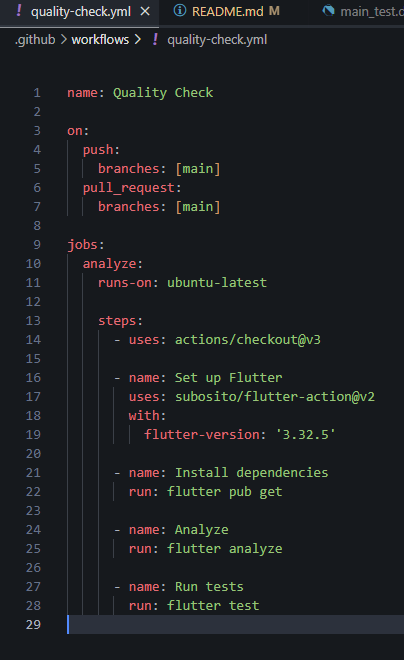
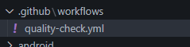
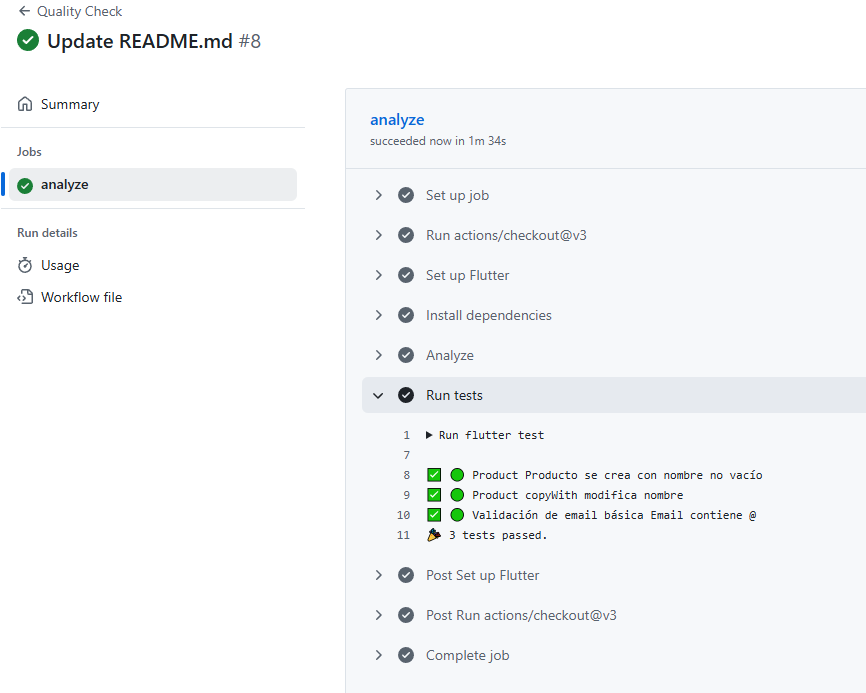

# SM2_ExamenUnidad3

**Curso:** SOLUCIONES MÓVILES II
**Fecha:** 27 de junio de 2025  
**Estudiante:** Escobar Rejas, Carlos Andrés 

## 📎 URL del repositorio

[https://github.com/MrPol4r/SM2_ExamenUnidad3](https://github.com/MrPol4r/SM2_ExamenUnidad3)

---

## 📂 Estructura del proyecto

- `.github/workflows/quality-check.yml`
- `test/main_test.dart`
- Todo el proyecto móvil dentro del repositorio público

Ejemplo de estructura:
```
SM2_ExamenUnidad3/
 ├── lib/
 ├── test/
 │   └── main_test.dart
 ├── .github/
 │   └── workflows/
 │       └── quality-check.yml
 ├── pubspec.yaml
 └── README.md
```

---

## ✅ Contenido del archivo `quality-check.yml`

```yaml
name: Quality Check

on:
  push:
    branches: [main]
  pull_request:
    branches: [main]

jobs:
  analyze:
    runs-on: ubuntu-latest

    steps:
      - uses: actions/checkout@v3

      - name: Set up Flutter
        uses: subosito/flutter-action@v2
        with:
          flutter-version: '3.32.5'

      - name: Install dependencies
        run: flutter pub get

      - name: Analyze
        run: flutter analyze

      - name: Run tests
        run: flutter test

```

---

## 🧪 Contenido de `main_test.dart`

```dart
import 'package:flutter_test/flutter_test.dart';
import 'package:proyecto_moviles_2/models/product.dart';

void main() {
  group('🟢 Product', () {
    test('Producto se crea con nombre no vacío', () {
      final product = Product(
        id: 'p1',
        nombre: 'Polo Azul',
        precio: 50.0,
        descuento: 5,
        descripcion: 'Polo básico azul',
        valoracion: 4.5,
        valoracionesTotal: 10,
        vendidos: 50,
        imagenes: ['img1.jpg'],
        colores: ['Azul'],
        colorImagenes: {'Azul': 'img1.jpg'},
        tallas: ['M'],
        descripcionTallas: 'Guía de tallas',
        comentarios: [],
        categoria: 'Polos',
        estado: 'disponible',
        stock: 5,
      );
      expect(product.nombre.isNotEmpty, true);
    });

    test('copyWith modifica nombre', () {
      final product = Product(
        id: 'p1',
        nombre: 'Polo Azul',
        precio: 50.0,
        descuento: 5,
        descripcion: 'Polo básico azul',
        valoracion: 4.5,
        valoracionesTotal: 10,
        vendidos: 50,
        imagenes: ['img1.jpg'],
        colores: ['Azul'],
        colorImagenes: {'Azul': 'img1.jpg'},
        tallas: ['M'],
        descripcionTallas: 'Guía de tallas',
        comentarios: [],
        categoria: 'Polos',
        estado: 'disponible',
        stock: 5,
      );

      final nuevo = product.copyWith(nombre: 'Polo Rojo');
      expect(nuevo.nombre, 'Polo Rojo');
    });
  });

  group('🟢 Validación de email básica', () {
    test('Email contiene @', () {
      String email = 'usuario@test.com';
      bool valido = email.contains('@');
      expect(valido, true);
    });
  });
}

```

---

## 📸 Evidencia del workflow en Actions

### 1️⃣ Carpeta `.github/workflows/`  


### 2️⃣ Contenido del archivo `quality-check.yml`  


### 3️⃣ Ejecución del workflow en Actions  


---

## ✏️ Explicación de lo realizado

- Se creó el repositorio público **SM2_ExamenUnidad3** y se copió todo el proyecto móvil.
- Se configuró la carpeta `.github/workflows/` y se agregó `quality-check.yml` con las tareas: `flutter analyze` y `flutter test`.
- Se agregaron al menos 3 pruebas unitarias básicas en `main_test.dart`.
- Se verificó que el workflow se ejecuta automáticamente al hacer push o pull request, comprobando que todas las tareas pasen correctamente.
- Las evidencias se incluyen en capturas de pantalla.

---

## 📌 Consideraciones

- El repositorio es público.
- El workflow está correctamente ubicado y se ejecuta de forma automática.
- Este archivo README.md se entregará en formato PDF como evidencia final del examen.
